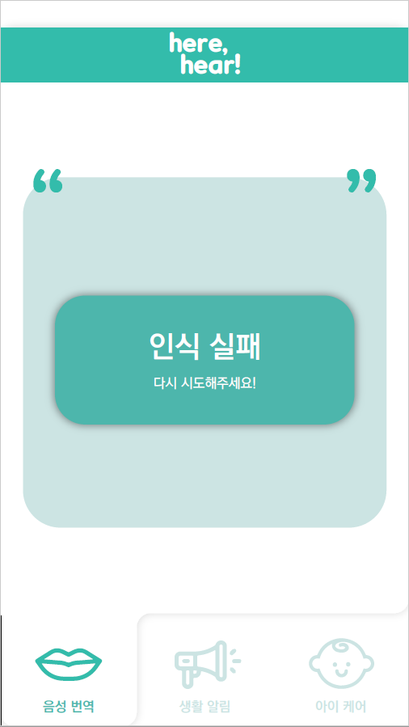
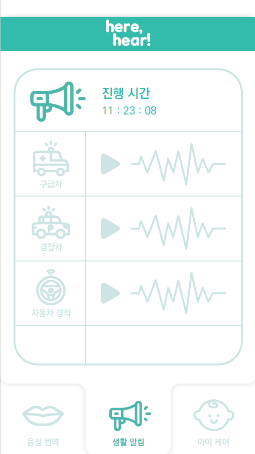
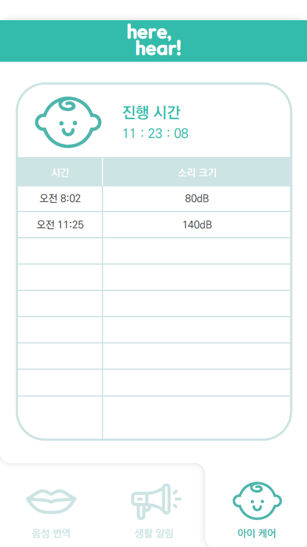

#### UI 설계
* 전체 UI는 "jcp UI design.pdf" 참고

* 주요 기능 UI

---

  + STT UI </b>

  
---

  + danger sound classifier UI </b>

---

  + cry baby classifier UI </b>

---

* UI 담당자
  + UI 설계 - 이근주
  + UI 디자인 - 김예인

#### SW 설계

---

  

---

* 1) 아이 울음 감지 기능 개발 - 담당자 : 이근주
	+ 사전에 얼굴 감정 분석 Classfier를 위한 CNN Classifier
	+ 웹캠으로 촬영 및 image로 변환
  + 라즈베리파이와 Appliccation을 firebase를 통해 통신

* 2) 위험 소리 감지 기능 개발 - 담당자 : 한인수
	+ 위험 소리 Classifier을 위한 위험 소리 데이터 Crawler
	+ 수집한 소리 기반으로 CNN Classifier
	+ Android Studio에서 Sound Recording 및 4초 단위 Split
  + Django - Application 통신 ( 정근화 )

* 3) 비장애인과 번역 기능 개발 및 안드로이드 스튜디오 Front-end 개발 - 담당자 : 정근화 & 길재은
	* UI 디자인 및 Danger Sound Fragment Design
	* STT 개발
