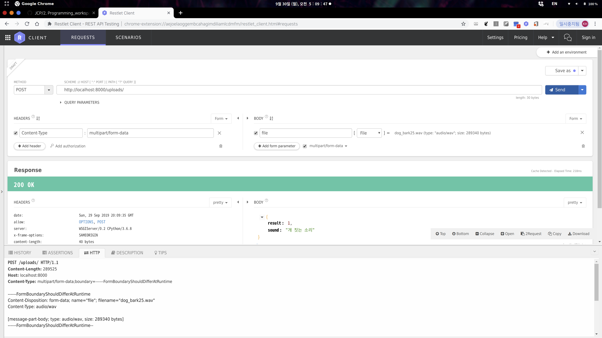

# JCP-DS-Server

##### JCP Danger Sound Server : JCP 프로젝트 청각장애인을 위한 위험소리 분류모델 서버

**GCE(임시) + Ubuntu18.04 + Django + Nginx 로 운영중입니다.**

- Server URL : http://35.233.183.56:8000 (임시)
- JCP Repository : https://github.com/allcle/JCP


### Install - ubuntu
```
# For Ubuntu18.04
# 클론
$ git clone THIS_REPOSITORY_URL
$ cd CLONED_DIRECTORY

# 가상환경 생성
$ python3 -m venv env
$ source env/bin/activate

# 가상환경에 라이브러리 설치
# tensorflow, keras 는 다운그레이드 버전에서 실행 - views.py 주석 참고
#   - 최신버전 오류발생 : https://github.com/keras-team/keras/issues/13336

(env)$ pip install django
(env)$ pip install djangorestframework
(env)$ pip install librosa
(env)$ pip install tensorflow==1.13.1
(env)$ pip install keras==2.2.4
(env)$ pip install pillow
(env)$ pip install matplotlib

# 테스트 서버 실행 확인
$ python manage.py runserver

# Nginx, uWSGI 연동방법
 - https://uwsgi-docs.readthedocs.io/en/latest/tutorials/Django_and_nginx.html
 - https://twpower.github.io/41-connect-nginx-uwsgi-django
 
# 실 서버 가동(Nginx, uWSGI 환경 설정 완료상태)
(env)$ uwsgi --socket :8001 --module jcp.wsgi

```


## API Usage

|   Request Type    |            Request Value             |
| :---------------: | :----------------------------------: |
|     `Method`      |                `POST`                |
|       `URL`       | `http://35.233.183.56:8000/uploads/` |
|    **HEADER**     |                                      |
|  `Content-Type`   |        `multipart/form-data`         |
|     **BODY**      |                                      |
|      `file`       |        `음성 파일 업로드.wav`        |
| **Response BODY** |          **Response Value**          |
|     `result`      |         `소리 인덱스(0 ~ 5)`         |
|      `sound`      |        `소리 분류( ** 소리)`         |


### Request Sample - cURL

```
$ curl -X POST \
  http://35.233.183.56:8000/uploads/ \
  -H 'cache-control: no-cache' \
  -H 'content-type: multipart/form-data; boundary=----WebKitFormBoundary7MA4YWxkTrZu0gW' \
  -F file=@dog_bark35.wav
  
{ "result": 2, "sound": "드릴 소리" }
```


### Request Sample - HTTP

```
POST /uploads/ HTTP/1.1
Content-Length: 300108
Host: 35.233.183.56:8000
Content-Type: multipart/form-data;boundary=------FormBoundaryShouldDifferAtRuntime

------FormBoundaryShouldDifferAtRuntime
Content-Disposition: form-data; name="file"; filename="drilling3.wav"
Content-Type: audio/wav

[message-part-body; type: audio/wav, size: 299924 bytes]
------FormBoundaryShouldDifferAtRuntime--

HTTP/1.1 200 OK
date: Sun, 29 Sep 2019 20:23:59 GMT
allow: OPTIONS, POST
server: WSGIServer/0.2 CPython/3.6.8
x-frame-options: SAMEORIGIN
content-length: 36
vary: Accept, Cookie
content-type: application/json

{"result":2,"sound":"드릴 소리"}
```


###  Request sample - Restlet Client

### 