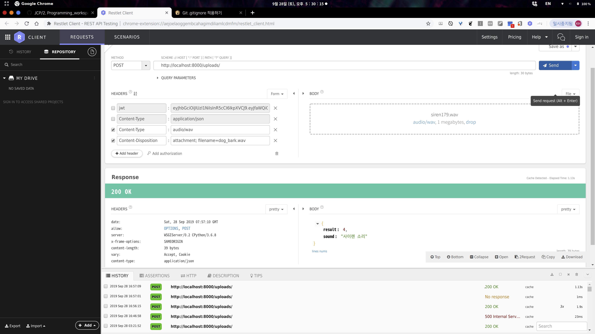

# JCP-DS-Server

##### JCP Danger Sound Server : JCP 프로젝트 청각장애인을 위한 위험소리 분류모델 서버

- Server URL : 미정


### Install - ubuntu
```
# For Ubuntu18.04
# 클론
$ git clone THIS_REPOSITORY_URL
$ cd CLONED_DIRECTORY

# 가상환경 생성
$ python3 -m venv env
$ source env/bin/activate

# 가상환경에 라이브러리 설치
# 관리자 권한으로 두번 설치해야 하는 라이브러리 있음(librosa, tensorflow, keras
# tensorflow, keras 는 다운그레이드 버전에서 실행 - views.py 주석 참고
#   - 최신버전 오류발생 : https://github.com/keras-team/keras/issues/13336

(env)$ pip install django
(env)$ pip install djangorestframework
(env)$ pip install librosa
(env)$ sudo pip install librosa
(env)$ pip install tensorflow==1.13.1
(env)$ sudo pip install tensorflow==1.13.1
(env)$ pip install keras==2.2.4
(env)$ sudo pip install keras==2.2.4
(env)$ pip install pillow
(env)$ pip install matplotlib

# 서버 실행
$ python manage.py runserver
```


### API Usage

|     Request Type      |            Request Value            |
| :-------------------: | :---------------------------------: |
|       `Method`        |               `POST`                |
|         `URL`         |  `http://SERVERURL:8000/uploads/`   |
|      **HEADER**       |                                     |
|    `Content-Type`     |             `audio/wav`             |
| `Content-Disposition` | `attachment; filename=파일이름.wav` |
|       **BODY**        |                                     |
|        `File`         |       `음성 파일 업로드.wav`        |
|   **Response BODY**   |         **Response Value**          |
|       `result`        |        `소리 인덱스(0 ~ 5)`         |
|        `sound`        |        `소리 분류( ** 소리)`        |


### Restlet Client - request sample

### 